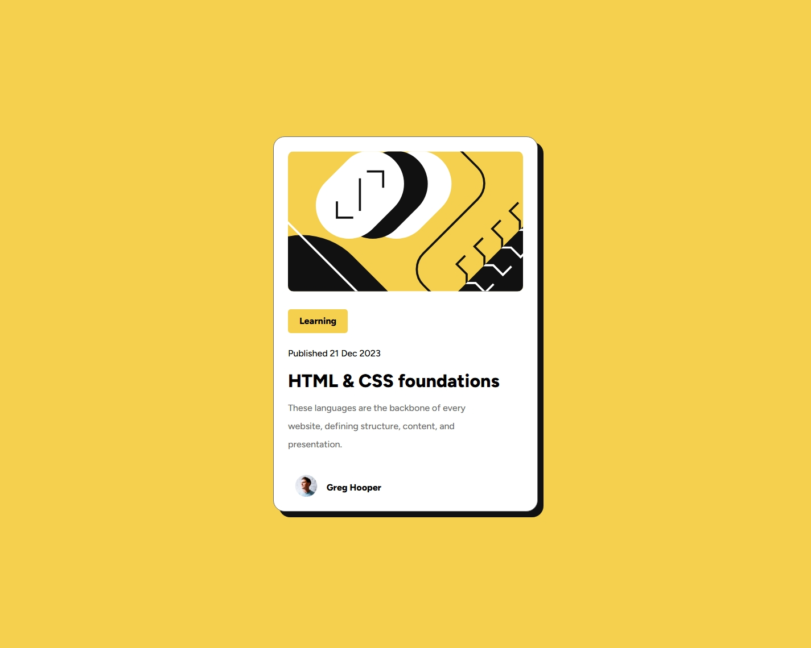
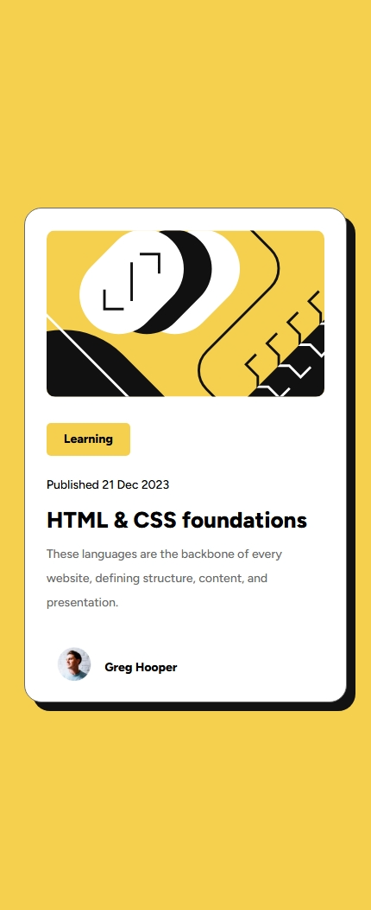

# Frontend Mentor - Blog preview card solution

This is a solution to the [Blog preview card challenge on Frontend Mentor](https://www.frontendmentor.io/challenges/blog-preview-card-ckPaj01IcS). Frontend Mentor challenges help you improve your coding skills by building realistic projects. 

## Table of contents

- [Overview](#overview)
  - [Screenshot](#screenshot)
  - [Links](#links)
- [My process](#my-process)
  - [Built with](#built-with)
  - [What I learned](#what-i-learned)
- [Author](#author)

## Overview

### Screenshot

Desktop

Mobile

### Links

- Solution URL: [Solution URL here](https://github.com/abdullah09c/blog-preview-card-main.git)
- Live Site URL: [Live site URL here](https://abdullah09c.github.io/blog-preview-card-main/)

## My process

### Built with

- Semantic HTML5 markup
- CSS custom properties

**Note: These are just examples. Delete this note and replace the list above with your own choices**

### What I learned

Nothing so far, but I am looking forward to learning more about responsive design and CSS Grid in future projects.

## Author

- Frontend Mentor - [@abdullah09c](https://www.frontendmentor.io/profile/abdullah09c)
- GitHub - [@abdullah09c](https://www.github.com/abdullah09c)

